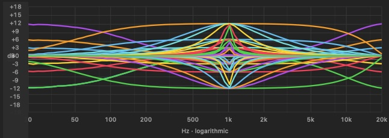

# Yamaha Motif ES 3-Band EQ Curves Dataset



This repository contains a comprehensive CSV dataset mapping the hardware response curves of the integrated 3-band Equalizer on a 2003 Yamaha Motif ES physical synthesizer workstation. 

This data is intended for audio engineers, machine learning researchers, and digital signal processing (DSP) developers focused on hardware emulation and filter modeling.

## 📦 Dataset Specifications
* **Hardware Source:** Yamaha Motif ES Physical Unit
* **File Format:** `.csv` (Comma-Separated Values)
* **Total Sweeps:** 50 distinct hardware runs
* **Frequency Range:** 20 Hz to 20,000 Hz
* **Data Resolution:** 73 measured discrete points per run

## 🔍 File Layout & Data Structure
The dataset is split across two flat, single-table CSVs (an earlier combined-file version briefly existed but was replaced -- GitHub's CSV renderer can't handle a column count that changes partway through a file, so each table now gets its own file).

### `Motif EQ Summary.csv` -- run metadata
One row per hardware run, describing the parameters used for each of the 50 sweeps.

| Column Name | Data Type | Description |
| :--- | :--- | :--- |
| `Label` | String | Unique run identifier linking metadata to the matching column in `Motif EQ Curves.csv` |
| `Band` | Integer | Active equalizer band (`1` = Low, `2` = Mid, `3` = High) |
| `Shape` | String | EQ filter topology type (`Bell`, `Low Shelf`, `High Shelf`) |
| `Target Freq (Hz)`| Integer | Target center/corner frequency assigned on the hardware interface |
| `Gain (dB)` | Integer | Active hardware gain setting applied during the run (ranging from -12 to +12) |
| `Q` | Float | Filter Quality factor width setting (ranges from 0.1 to 12.0) |
| `Points` | Integer | Total frequency sampling steps captured per run (`73`) |
| `Captured At` | ISO-8601 Timestamp | Exact execution date and time of the physical sweep capture |

### `Motif EQ Curves.csv` -- the frequency sweep matrix
* **Row Index:** The first column (`Frequency (Hz)`) is the independent variable, moving from 20 Hz to 20,000 Hz across 73 log-spaced sampling steps.
* **Feature Columns:** The remaining 50 columns are named exactly after the `Label` fields in `Motif EQ Summary.csv`. Each column holds that run's real-world measured output variation in decibels (dB).

## ⚖️ License (CC0 1.0 Universal)
This project is dedicated to the public domain. You are completely free to use this data for training neural networks, reverse-engineering digital filters, constructing audio algorithms, or publishing academic work without any operational restrictions, legal hurdles, or attribution requirements.

## 🛠️ Python Usage Example

Both files are plain, single-table CSVs, so no row-skipping tricks are needed -- just load each one directly with `pandas`.

```python
import pandas as pd
import matplotlib.pyplot as plt

# 1. Load each file directly
metadata_df = pd.read_csv("Motif EQ Summary.csv")
data_matrix_df = pd.read_csv("Motif EQ Curves.csv")

# Review the clean structures
print("--- Metadata Sample ---")
print(metadata_df.head(3))
print("\n--- Data Matrix Sample ---")
print(data_matrix_df.head(3))

# 2. Optional: Quick Validation Plot
# Plots the frequency sweeps for the low shelf, mid bell, and high shelf filters
plt.figure(figsize=(10, 6))
for column in data_matrix_df.columns[1:]: # Skip 'Frequency (Hz)' column
    plt.semilogx(data_matrix_df['Frequency (Hz)'], data_matrix_df[column], alpha=0.5)

plt.title('Yamaha Motif ES Integrated 3-Band EQ Response Sweeps')
plt.xlabel('Frequency (Hz)')
plt.ylabel('Measured Output Response (dB)')
plt.grid(True, which="both", ls="-")
plt.show()
```
